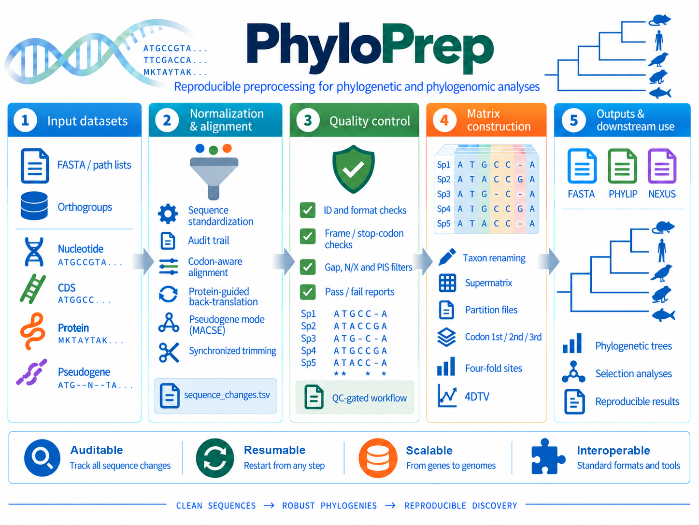
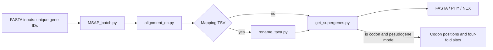

# PhyloPrep

PhyloPrep prepares nucleotide, CDS, protein, and pseudogene alignments for phylogenetic analysis. It includes a complete workflow (`phyloprep.py`) and standalone utilities for alignment, QC, concatenation, format conversion, trimming, taxon renaming, four-fold-site extraction, and 4DTV.



## Contents

1. [Install](#install)
2. [Quick start](#quick-start)
3. [Input modes and normalization](#input-modes-and-normalization)
4. [Complete workflow](#complete-workflow)
5. [Outputs and audit reports](#outputs-and-audit-reports)
6. [Script reference](#script-reference)
7. [QC and tree building](#qc-and-tree-building)
8. [Divergence statistics: 4DTV and related values](#divergence-statistics-4dtv-and-related-values)
9. [Testing and troubleshooting](#testing-and-troubleshooting)
10. [Containerized examples](#containerized-examples)

## Install

Required: Python >=3.8, Biopython, and one aligner (MAFFT is the default). Linux/POSIX is required for safe batch locking and publication.

Optional: MUSCLE, PRANK, ClustalW2, trimAl, and Java plus[ `macse_v2.07.jar`](https://www.agap-ge2pop.org/wp-content/uploads/macse/releases/macse_v2.07.jar) for pseudogene mode.

```bash
conda create -n phyloprep python=3.11 biopython mafft
conda activate phyloprep
conda install -c bioconda muscle prank clustalw trimal
```

### Singularity / Apptainer

`Singularity.def` obtains the Ubuntu 22.04 base image from Singularity Library,
then installs Python 3.11, Biopython, MAFFT, MUSCLE 5, PRANK, ClustalW2,
trimAl, Java and OrthoFinder 2.5.5. The image provides OrthoFinder's bundled
DIAMOND, MCL and FastME binaries, plus FastTree and IQ-TREE from Bioconda for
its tree-inference methods and NCBI BLAST+ for OrthoFinder DNA (`-d`) input.
It downloads MACSE v2.07 from the
[official MACSE release URL](https://www.agap-ge2pop.org/wp-content/uploads/macse/releases/macse_v2.07.jar)
and verifies its SHA-256 digest. Network access is required for Singularity
Library, Conda and MACSE.

`build_singularity.sh` locates the repository automatically before invoking
Singularity, so it can be called from any working directory. The output path
is interpreted from the directory in which the command is run:

```bash
cd /path/to/MSAP/example
sudo ../build_singularity.sh phyloprep.sif
```

The image entry point is `phyloprep.py`; the current directory is normally
available inside the container, so input and result paths can remain relative:

```bash
singularity run phyloprep.sif -i genes.pathlist -st codon -j 8 -t 1 -o results

# Run OrthoFinder in the same image when required.
singularity exec phyloprep.sif orthofinder -f proteomes -t 16 -a 4
```

Run from this directory or add it to `PATH`. Use `python SCRIPT.py --help` for the installed command definition.

## Quick start

```bash
# Complete CDS workflow
python phyloprep.py -i genes.pathlist -st codon -t 4 -j 2 -o results

# Rename taxa before alignment
python phyloprep.py -i genes.pathlist -m taxa.tsv -st codon -o results

# Protein workflow without trimming
python phyloprep.py -i proteins.fa -st prot --notrim -o protein-results

# Frameshift/stop-tolerant pseudogene workflow
python phyloprep.py -i pseudo.pathlist -st pseudogene \
  --macse-jar macse_v2.07.jar -j 2 -o pseudo-results
```

## Containerized examples

Two end-to-end, Singularity/Apptainer-based examples are available: a
mitochondrial CDS workflow and a nuclear single-copy ortholog workflow that
includes reference-genome download, longest-transcript selection, OrthoFinder,
and PhyloPrep. See the Chinese step-by-step tutorial at
[`TUTORIAL.md`](TUTORIAL.md). The `phyloprep.sif` image and
complete example data will be released through Zenodo; the DOI is currently a
placeholder in that tutorial.

## Input modes and normalization

Inputs are FASTA. IDs must be unique within a file; alignment tools require at least two non-empty sequences. A path-list contains one FASTA path per line; blank lines and lines beginning `#` or `;` are ignored.

| `-st` mode | Input requirement | Standardization |
| --- | --- | --- |
| `nucl` | DNA or RNA | `U` becomes `T`; `R/Y/S/W/K/M/B/D/H/V/?` become `N`. |
| `codon` | Ungapped CDS; a trailing 1–2-base excess is trimmed | Same nucleotide rules; terminal stops are removed and internal stops become `NNN`; trailing excess bases are audited. |
| `prot` | Protein sequences | Selected trailing stop symbol is removed; internal stops and `B/Z/J/O/U/?` become `X`. |
| `pseudogene` | Ungapped DNA in coding orientation | MACSE handles stops and frameshifts; standardized NT/AA outputs use `N`/`X`. |

Original input files are never changed. Each replacement is recorded in `sequence_changes.tsv`. Coordinates are 1-based inclusive. Use `--protein-stop-symbol .` (alias `--stop-symbol .`) for dot-encoded protein stops.

## Complete workflow

`phyloprep.py` is the recommended command. It runs `MSAP_batch.py` using the original, unique gene IDs, optionally renames all raw and trimmed alignment matrices, QC-checks them independently, concatenates passing genes, splits codon positions, extracts four-fold sites, and exports FASTA, relaxed PHYLIP, and NEXUS.

The following project diagram shows how the executable scripts connect. It is
also useful as a reference when running any component independently.




| Important option | Purpose |
| --- | --- |
| `-i FASTA|LIST ...` | FASTAs, path lists, or both. |
| `-o DIR` | Pipeline directory; default `phyloprep-results`. |
| `-m TSV` | Two-column gene-ID/taxon-ID mapping applied after MSA and before QC/concatenation. |
| `-st` | `codon`, `nucl`, `prot`, or `pseudogene`. |
| `-t N`, `-j N` | MAFFT/MUSCLE threads and concurrent jobs. |
| `--missing-taxa` | `skip-gene` or `pad-gaps` during concatenation. |
| `--min-length`, `--max-*-ratio`, `--min-parsimony-informative-sites` | QC thresholds. |
| `-g TABLE` | NCBI genetic-code table; default 1. |
| `--macse-jar`, `--macse-memory` | Pseudogene MACSE settings. |

`--trimal-args` forwards remaining arguments to trimAl and must be the final option. In codon and pseudogene modes, PhyloPrep runs trimAl on the paired protein alignment, obtains its retained protein columns, and transfers them to complete codon triplets; users must not pass trimAl's `-in`, `-out`, `-fasta`, `-backtrans`, or `-colnumbering` options because PhyloPrep manages them. Pseudogene workflows retain other matrices if no four-fold sites remain, writing `fourfold.skipped.txt`.

## Outputs and audit reports

```text
results/
  renamed/<type>/<raw|trimmed>/    # passing matrices after -m ID mapping
  alignments/                      # batch products and checkpoints
  reports/sequence_changes.tsv     # merged provenance report
  qc/<type>/<raw|trimmed>/          # pass, fail, and details TSVs
  matrices/
    codon/<raw|trimmed>/            # supermatrix, codon1st/2nd/3rd, fourfold
    prot/<raw|trimmed>/             # protein supermatrix
    nucl/<raw|trimmed>/             # nucleotide supermatrix
    pseudogene/<codon|prot>/<raw|trimmed>/
```

Every final matrix has `.fasta`, `.phy`, and `.nex` products. Concatenation also creates gene-inclusion reports and partition files for PartitionFinder and IQ-TREE. Publication is staged, so failed processing does not publish partial matrices.

## Script reference

### `phyloprep.py` — complete workflow

Use for routine phylogenomic preparation. It accepts all batch options plus mapping and QC options.

```bash
python phyloprep.py -i genes.pathlist -m taxa.tsv -st codon -t 4 -j 2 -o results
```

`-m/--mapping` is deliberately applied **after** MSA and **before** QC. This
lets each orthogroup contain unique gene IDs during alignment, then assesses
the renamed taxon matrices during QC before species-supermatrix construction.
The per-alignment mapping records are written below `reports/renamed_ids/`.
Renaming is resumable: an unchanged source alignment, mapping file,
`rename_taxa.py`, renamed FASTA, and mapping report are skipped on a later run.
Use `--no-resume` to force this step as well as MSAP batch alignment to rerun.

When `-m` is omitted, PhyloPrep attempts concatenation using the original IDs.
If no loci share a consistent taxon set, it stops after retaining
`reports/concatenation/<type>/<raw|trimmed>/original_ids.report.tsv` and tells
the user to supply a mapping. Mapping cannot make an all-copies orthogroup into
a species matrix: if two genes in one alignment map to the same taxon, QC marks
that matrix as `duplicate_ids` and the pipeline stops before concatenation. Keep
those gene IDs and use per-orthogroup gene trees with ASTRAL-Pro3 or another
duplication-aware method.

### `MSAP.py` — single-gene alignment

Aligns one gene. Codon mode translates, aligns protein, and back-translates; pseudogene mode uses MACSE.

```bash
python MSAP.py -i CDS.fa -st codon -g 1 -t 4
python MSAP.py -i proteins.fa -st prot --protein-stop-symbol .
python MSAP.py -i pseudo.fa -st pseudogene --macse-jar macse_v2.07.jar
```

Outputs use `GENE.ALIGNER.{nucl|prot|codon}[.trimal].aln`; audit reports are retained.

### `MSAP_batch.py` — concurrent, resumable alignment

Runs `MSAP.py` for multiple FASTAs. `-j` controls concurrent jobs and `-t` controls MAFFT/MUSCLE threads per job. Use `--no-resume` to force recomputation.

```bash
python MSAP_batch.py -i gene1.fa gene2.fa -st nucl -j 4 -o msap-results
```

It writes validated alignments, checkpoints, reports, and current path lists under `path-lists/`.

### `alignment_qc.py` — matrix QC

Checks IDs, lengths, gap/N/X ratios, PIS, and codon frame/stops. It writes `PREFIX.pass.tsv`, `PREFIX.fail.tsv`, and `PREFIX.details.tsv`.

```bash
python alignment_qc.py -i alignments.pathlist -st codon -p qc/codon \
  --max-n-ratio 0.2 --min-parsimony-informative-sites 20
```

Codon gaps must be `---`. Stops fail by default; use `--allow-terminal-stop` or `--allow-internal-stop` only when justified.

### `get_supergenes.py` — supermatrix and partitions

Concatenates aligned genes and writes `PREFIX.fasta`, `PREFIX.phy`, a report, and partition files. `skip-gene` excludes incomplete loci; `pad-gaps` retains them with gaps.

```bash
python get_supergenes.py -i qc/alignment.pass.tsv -p matrices/supermatrix --missing-taxa pad-gaps
```

### `split_codon_seqence_alignment.py` — codon-position matrices

Splits one codon alignment into `codon1st.`, `codon2nd.`, and `codon3rd.` FASTAs in the working directory.

```bash
python split_codon_seqence_alignment.py -i supermatrix.fasta
```

### `extract_4-fold_degenerated_sites.py` — four-fold sites

Retains third positions only if all taxa have valid matching four-fold codons. Ambiguity and gaps exclude a site.

```bash
python extract_4-fold_degenerated_sites.py -i supermatrix.fasta -o fourfold.fasta -g 1
```

### `AA2Codon.py` — protein-to-codon back-translation

Maps each non-gap protein position to its matching CDS codon. IDs must match exactly. `-g` validates translations.

```bash
python AA2Codon.py -c CDS.fa -p protein.aln.fa -o codon.aln.fa -g 1
```

### `trimAlnSeq.py` — threshold trimming

Trims nucleotide/protein sites or whole codon triplets using gap and N/X ratios. `-ra` removes invariant sites. `-i -` reads stdin; no `-o` writes stdout. Zero retained sites is an error.

```bash
python trimAlnSeq.py -i gene.aln.fa -o gene.trim.fa -st codon -G 0.2 -N 0.2
```

### `filter_sequences.py` — taxon filtering

Filters complete sequences by length, gap/N/X ratios, and keep/remove taxon lists; then removes all-missing columns.

```bash
python filter_sequences.py -i alignment.fa -o retained.fa -st prot --max-x-ratio 0.1 --keep-taxa taxa.txt
```

### `rename_taxa.py` — FASTA ID renaming

Reads a two-column tab-separated mapping and applies OrthoFinder result-label substitutions: `:`, `,`, `(` and `)` become `_`. FASTA IDs cannot contain whitespace. `--keep-special` remains only as a deprecated compatibility flag and does not disable those substitutions.

```bash
python rename_taxa.py -i input.fa -o renamed.fa -m taxa.tsv --map-output applied.tsv
```

### `extract_orthofinder_orthogroups.py` — OrthoFinder orthogroup sequence extraction

Reads OrthoFinder `Orthogroups.tsv` with the standard-library `csv` module and writes one FASTA per retained orthogroup. `-i`, `-f`, and `--sequence-dir` are equivalent and accept a sequence directory following OrthoFinder `-f` conventions: one FASTA per taxon, with the filename stem exactly matching an `Orthogroups.tsv` taxon column. It accepts `.fa`, `.faa`, `.fasta`, `.fas`, and `.pep`. The directory may contain either CDS or protein sequences; select `phyloprep.py -st codon` or `-st prot` to match it.

```bash
# Strict one-to-one orthogroups across all retained taxa (default)
python extract_orthofinder_orthogroups.py \
  -og Results/Orthogroups/Orthogroups.tsv -f cds/ \
  --keep-taxa Human Mouse Zebrafish -o one_to_one_cds

# Retain a single-copy OG when at least 8 selected taxa are present
python extract_orthofinder_orthogroups.py \
  -og Orthogroups.tsv -f cds/ --min-taxa 8 -X -o occupancy8_cds

# Preserve every paralogous copy for gene trees used with ASTRAL-Pro3
python extract_orthofinder_orthogroups.py \
  -og Orthogroups.tsv -f proteins/ --copy-mode all-copies --min-taxa 8 \
  -o astralpro_gene_sets
```

| Option or mode | Occupied taxon definition | Written sequences | Intended use |
| --- | --- | --- | --- |
| `--copy-mode single-copy` (default) | The OG cell contains exactly one gene. | One gene for each occupied taxon. | Concatenation, conventional one-to-one species-tree workflows. |
| `--copy-mode all-copies` | The OG cell contains one or more genes. | Every listed gene, including paralogs. | Per-OG gene trees followed by ASTRAL-Pro3 or another duplication-aware method. |

`--min-taxa` is evaluated under the selected mode. Its upper bound is the number of taxa remaining after `--keep-taxa` and `--drop-taxa`; omitting it requires every selected taxon to meet the mode definition. Both taxon options accept names or a one-name-per-line text file and may be combined. An overlap—for example `--keep-taxa Human Mouse --drop-taxa Mouse`—is an error.

The extractor automatically recognizes the `Orthogroups.tsv` ID convention. `Taxon_geneID` is treated as ordinary OrthoFinder output; source FASTA lookup removes that one prefix and default output retains it. Unprefixed `geneID` is treated as OrthoFinder `-X` output; lookup and default output remain unprefixed. `-X` always requests unprefixed exported IDs. A table mixing both forms is rejected; `--orthofinder-id-style prefixed|unprefixed` is available for a deliberately nonstandard converted table. `OUTDIR/map.tsv` is written as unheaded `FASTA_ID<TAB>Taxa` rows for every exported sequence; its first column always exactly matches the FASTA ID, so it can be supplied directly to `phyloprep.py -m` with or without `-X`. Use `--map-output FILE` to choose another path. `OUTDIR/orthogroups.pathlist` contains one absolute path for every FASTA actually exported after filtering, so it can be supplied directly to `phyloprep.py -i`. The sequence IDs in this directory must match the IDs used to produce `Orthogroups.tsv` after OrthoFinder-compatible normalization.

```bash
python phyloprep.py -i one_to_one_cds/orthogroups.pathlist -st codon -o phyloprep_results
```

### Orthology-result adapters — shared orthogroup input standard

`extract_orthofinder_orthogroups.py` consumes a tab-separated table whose first column is `Orthogroup`, whose remaining columns are taxa, and whose cells contain zero or more comma-separated gene IDs. This is OrthoFinder `Orthogroups.tsv` format. The following dependency-free adapters convert common equivalent outputs to that table; then use the extractor exactly as for OrthoFinder.

| Source software | Adapter | Accepted source result | Notes |
| --- | --- | --- | --- |
| OrthoFinder | No conversion | `Orthogroups.tsv` or an appropriate HOG-level TSV | Pass directly to the extractor. |
| Proteinortho | `proteinortho_to_orthogroups.py` | `.proteinortho` or `.poff` table | Reads its three metadata columns and FASTA-file taxon columns. |
| SonicParanoid / SonicParanoid2 | `sonicparanoid_to_orthogroups.py` | `flat.ortholog_groups.tsv` | Reads `group_id` plus FASTA-file taxon columns. |
| OrthoMCL | `orthomcl_to_orthogroups.py` | `groups.txt` | Parses `GROUP: taxon|gene ...` records. |
| OMA Standalone | `oma_to_orthogroups.py` | `Output/OrthologousGroups.txt` | Parses its tab-separated group and member rows. |

```bash
# Proteinortho -> standard table -> orthogroup FASTAs
python proteinortho_to_orthogroups.py \
  -i results.proteinortho -o proteinortho.orthogroups.tsv
python extract_orthofinder_orthogroups.py \
  -og proteinortho.orthogroups.tsv -f cds/ --min-taxa 8 -o proteinortho_cds

# SonicParanoid / SonicParanoid2
python sonicparanoid_to_orthogroups.py \
  -i flat.ortholog_groups.tsv -o sonic.orthogroups.tsv
python extract_orthofinder_orthogroups.py -og sonic.orthogroups.tsv -f cds/ -o sonic_cds

# OrthoMCL and OMA labels normally take the form Taxon|GeneID.
# Strip Taxon| only when CDS FASTA IDs are GeneID rather than Taxon|GeneID.
python orthomcl_to_orthogroups.py -i groups.txt -o orthomcl.orthogroups.tsv \
  --strip-taxon-prefix
python oma_to_orthogroups.py -i Output/OrthologousGroups.txt -o oma.orthogroups.tsv \
  --strip-taxon-prefix
```

The adapters do not infer or change orthology relationships. They only preserve group membership, taxon identity, and all comma-separated copies in a common table. Before extraction, ensure the resulting table IDs and input FASTA IDs are identical after the OrthoFinder-compatible substitutions used by `rename_taxa.py`.

### `fasta2phy.py`, `fasta2nex.py`, `fasta2axt.py` — format conversion

All protect input/output/report paths from collision. DNA ambiguity becomes `N`; protein ambiguity becomes `X`; edits write an adjacent audit TSV or the path passed to `--changes-report`.

```bash
python fasta2phy.py -i matrix.fa -o matrix.phy -st DNA
python fasta2nex.py -i proteins.fa -o proteins.nex -st protein
python fasta2axt.py -i pairwise.fa -o pairwise.axt -st DNA
```

`fasta2axt.py` requires exactly two aligned records. `fasta2nex.py` also supports `-st RNA` and round-trip validates its NEXUS output.

### `calulate_4dtv_and_correction.py` — raw and corrected 4DTV

Calculates raw and HKY-corrected 4DTV for exactly two-sequence codon alignments.
This is a maintained analysis tool, not a legacy-only utility. It accepts FASTAs,
path lists, or a mixture of both, and writes one row per pairwise alignment.

```bash
python calulate_4dtv_and_correction.py -i pairwise.pathlist -o 4dtv.tsv -g 1
```

Its TSV columns are described in the [4DTV section](#divergence-statistics-4dtv-and-related-values).

### `sequence_audit.py` and `msap_io.py` — internal libraries

These are imported by workflow scripts. They implement normalization, MACSE provenance, report merging, FASTA/path-list validation, stop-codon logic, atomic writes, and output-path protection.

## QC and tree building

PIS counts only resolved states. `N`, `X`, gaps, stops, and other unknown states do not contribute. A zero-PIS matrix can be read by IQ-TREE but does not inform topology; use `--min-parsimony-informative-sites` to enforce a project-specific threshold.

There is no universal minimum PIS for 32 taxa. Evaluate PIS with alignment length, missing data, bootstrap support, gene concordance, and the biological divergence of the sample. Use the same NCBI genetic code in downstream codon analyses.

## Divergence statistics: 4DTV and related values

`calulate_4dtv_and_correction.py` estimates sequence divergence from four-fold
degenerate codon positions. It expects **exactly two taxa per input alignment**;
for a multi-taxon codon matrix, first create pairwise alignments or export each
pair into its own FASTA. The same `-g/--genetic-code` used for codon preparation
must be supplied here.

```bash
# One pairwise codon alignment
python calulate_4dtv_and_correction.py -i speciesA_speciesB.codon.fa \
  -o species_pairs.4dtv.tsv -g 1

# A list of pairwise alignments
python calulate_4dtv_and_correction.py -i pairwise.pathlist -o all.4dtv.tsv -g 1
```

| Output column | Meaning | Interpretation |
| --- | --- | --- |
| `Input file prefix` | Source alignment basename | Identifies the pair/locus. |
| `Sequence1 name`, `Sequence2 name` | FASTA IDs | Pairwise taxon labels. |
| `raw_4dtv` | Fraction of eligible four-fold sites that are transversions | Direct observed divergence summary. |
| `corrected_4dtv` | HKY-corrected transversion divergence | Attempts to account for multiple substitutions and base composition. |
| `fourfold_sites_total_number` | Eligible comparable four-fold sites | Effective sample size for both estimates. |
| `fourfold_sites_transversion_number` | Observed transversions among eligible sites | Numerator of `raw_4dtv`. |

The program writes `NA` for corrected or raw values when no eligible sites
exist, or when the correction is mathematically undefined. Do not compare noisy
4DTV estimates with very small `fourfold_sites_total_number`; report that count
beside every estimate. Four-fold sites are useful for broad divergence summaries,
but they are not guaranteed neutral in every lineage or genomic compartment.

Other values already produced by this repository should be interpreted together
with 4DTV rather than replaced by it:

| Value | Produced by | Use |
| --- | --- | --- |
| Alignment length | `alignment_qc.py` | Amount of homologous sequence retained. |
| Gap ratio | `alignment_qc.py` | Alignment completeness and indel burden. |
| N ratio / X ratio | `alignment_qc.py` | Fraction masked as unknown in nucleotide/protein matrices. |
| Variable sites | `alignment_qc.py` | Overall observed sequence variation. |
| PIS | `alignment_qc.py` | Topology-informing variation for tree inference. |
| Distinct site patterns | `alignment_qc.py` | Pattern diversity after masking and gaps. |
| Singleton sites | `alignment_qc.py` | Variation observed in only one taxon. |
| Constant sites | `alignment_qc.py` | Conserved portion of the aligned matrix. |
| Four-fold-site count | `extract_4-fold_degenerated_sites.py` and 4DTV TSV | Informative denominator for synonymous-site analyses. |

For species comparisons, report at least matrix length, gap/N/X ratios, PIS,
and four-fold-site count together with raw/corrected 4DTV. For phylogenetic
inference, assess bootstrap or other branch-support values in the tree-building
program as a separate measure of relationship confidence.

## Testing and troubleshooting

Before release:

```bash
python -m pytest -q
python -m compileall -q .
git diff --check
```

| Problem | Action |
| --- | --- |
| CDS has a trailing 1–2-base excess | `codon` trims it with a warning and `terminal_partial_codon` audit event. Internal frameshifts require `pseudogene`. |
| No alignments pass QC | Inspect `alignment.details.tsv`, then correct data or revise justified thresholds. |
| No four-fold matrix | Candidate sites were removed by ambiguity, gaps, or incompatible codon prefixes. |
| MACSE fails | Check Java, `--macse-jar`, and a valid memory value such as `2g`. |
| Output-path conflict | Use distinct input, output, and `--changes-report` paths. |
| Batch unexpectedly resumes | Add `--no-resume` after confirming recomputation is intended. |
