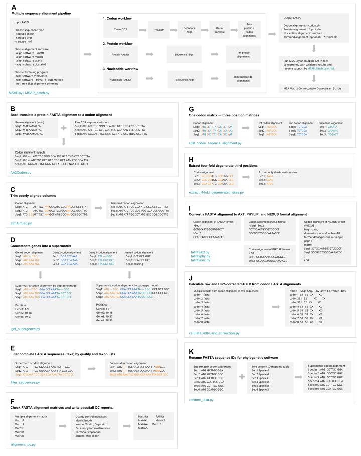

# PhyloPrep

**PhyloPrep: Reproducible preprocessing for phylogenetic and phylogenomic analyses**

Reproducible preparation of coding DNA,
protein and nucleotide FASTA files.

PhyloPrep combines sequence validation, codon-aware alignment, optional trimming,
supermatrix construction and downstream phylogenetic preparation in a small
set of command-line scripts.



PhyloPrep is the collective name for this workflow. `MSAP.py` is the main
multiple-sequence-alignment component, while `MSAP_batch.py` provides batch
execution.

> **Scope.** PhyloPrep prepares alignments and matrices; it does not replace the
> external aligners or phylogenetic programs used by the workflow.

## Highlights

- Codon-aware workflow: CDS → protein alignment → codon back-translation.
- Direct protein and nucleotide alignment workflows.
- MAFFT, MUSCLE, PRANK and ClustalW2 support.
- `trimAlnSeq.py` by default, or trimAl with user-supplied arguments.
- Validation of FASTA IDs, sequence type, CDS length and protein/CDS concordance.
- Supermatrix construction with `skip-gene` and `pad-gaps` missing-taxon modes.
- Four-fold degenerate-site extraction and raw/HKY-corrected 4DTV calculation.
- Concurrent batch execution with resumable checkpoints via `MSAP_batch.py`.

## Installation

Requirements:

- Python ≥ 3.8
- Biopython
- At least one supported aligner (MAFFT is the default)

```bash
git clone https://github.com/thecgs/MSAP.git
cd MSAP
python -m pip install biopython
conda install -c bioconda mafft
```

Optional programs:

```bash
conda install -c bioconda muscle prank clustalw2 trimal
```

## `MSAP.py` workflow (PhyloPrep alignment component)

| Input type | Processing route |
| --- | --- |
| `codon` | Validate CDS → remove terminal/internal stops → translate → align proteins → back-translate → optionally trim protein and codon alignments |
| `prot` | Validate proteins → align → optionally trim |
| `nucl` | Validate nucleotides → align → optionally trim |

Before invoking an aligner, MSAP checks that the input contains at least two
non-empty sequences with unique IDs. Codon input must be ungapped and have a
length divisible by three. Alternative initiator codons such as `GTG` are
treated as methionine at the first codon position.

### Quick start

```bash
# Codon alignment; MAFFT and trimAlnSeq.py are used by default.
MSAP.py -i CDS.fasta -st codon -g 1

# Protein alignment with MUSCLE and four alignment threads.
MSAP.py -i proteins.fasta -st prot -s muscle -t 4

# Nucleotide alignment with no trimming.
MSAP.py -i 16S.fasta -st nucl --notrim
```

Use `MSAP.py --help` for the complete interface. The public option aliases
include both hyphenated and legacy underscore forms where applicable.

### Trimming

`trimAlnSeq.py` is the default trimmer. Its thresholds are independent:

```bash
MSAP.py -i CDS.fasta -st codon \
  --trimAlnSeq-G 0.2 --trimAlnSeq-N 0.2 --trimAlnSeq-X 0.2
```

Select trimAl instead:

```bash
MSAP.py -i 16S.fasta -st nucl --trim-software trimal
```

Without custom arguments, trimAl uses `-automated1`. Pass trimAl arguments
unchanged with `--trimal-args`; this option must be last and replaces the
default:

```bash
MSAP.py -i 16S.fasta -st nucl --trim-software trimal \
  --trimal-args -gt 0.8 -cons 60
```

`--notrim` disables all alignment trimming, including both protein and codon
outputs in the codon workflow.

### Common output files

For `sample.fasta` aligned with MAFFT, a codon workflow typically produces:

| File | Description |
| --- | --- |
| `sample.CDS.fasta` | Cleaned CDS sequences |
| `sample.pep.fasta` | Translated protein sequences |
| `sample.mafft.prot.aln` | Protein alignment |
| `sample.mafft.codon.aln` | Back-translated codon alignment |
| `sample.mafft.prot.trimal.aln` | Trimmed protein alignment |
| `sample.mafft.codon.trimal.aln` | Trimmed codon alignment |

The two trimmed files are omitted when `--notrim` is used.

## Batch processing: `MSAP_batch.py` (PhyloPrep batch component)

`MSAP_batch.py` is the batch version of `MSAP.py`. It accepts the same MSAP
workflow and trimming options, then adds controls for concurrent input files
and output management.

For scripts that accept multiple alignments (`MSAP_batch.py`, `get_supergenes.py`
and `calulate_4dtv_and_correction.py`), `-i` accepts individual FASTA paths,
multiple paths, a text file containing one path per line (the extension is
irrelevant), or any mixture of these forms. `alignment_qc.py` accepts the same
input forms. A file is recognized as a path list when its first non-comment
line does not begin with `>`.

```bash
MSAP_batch.py -i gene1.fasta gene2.fasta gene3.fasta \
  -o msap-results -j 3 -t 4 -st codon
```

| Option | Meaning |
| --- | --- |
| `-j`, `--jobs` | Number of input files processed simultaneously |
| `-t`, `--thread` | Alignment threads used by each individual MSAP task |
| `-o`, `--output-dir` | Flat result directory; default `msap-results` |
| `--no-resume` | Ignore completed checkpoint records and rerun inputs |

Each input runs in a private staging directory. Files are promoted directly
into the flat output directory only after MSAP succeeds and expected alignment
files are present. Ctrl-C terminates active child processes; incomplete tasks
are not marked complete. Input basenames must be unique in a flat output
directory.

Completed tasks are recorded as hidden `.msap-batch-state-*.json` files. A
subsequent run skips a task only when its input path, size and modification time
still match the checkpoint.

After a successful batch run, the `path-lists/` subdirectory contains
absolute-path lists grouped by alignment type, such as
`path-lists/all.prot.aln.pathlist`, `path-lists/all.codon.aln.pathlist`,
`path-lists/all.prot.trimal.aln.pathlist` and
`path-lists/all.codon.trimal.aln.pathlist`. These files can be passed directly to
the multi-file QC and downstream scripts.

## Supermatrix construction

Use `get_supergenes.py` to concatenate aligned genes:

```bash
# Default: omit a gene from the final matrix when any taxon is missing.
get_supergenes.py -i gene1.fasta gene2.fasta gene3.fasta -p supermatrix

# Keep incomplete genes and pad missing taxa with gaps.
get_supergenes.py -i gene1.fasta gene2.fasta gene3.fasta -p supermatrix \
  --missing-taxa pad-gaps

# The same input can be supplied through a path list.
get_supergenes.py -i alignments.list -p supermatrix
```

Outputs:

```text
supermatrix.fasta
supermatrix.phy
supermatrix_partition_finder.cfg
supermatrix_part_iqtree.txt
supermatrix.report.tsv
```

The report records skipped genes and gap-padded taxa. The generated
PartitionFinder configuration references the PHYLIP alignment, not FASTA.

## Utility scripts

| Script | Purpose |
| --- | --- |
| `AA2Codon.py` | Back-translate a protein alignment to codons |
| `trimAlnSeq.py` | Trim alignments by gap, `N` and `X` thresholds |
| `split_codon_seqence_alignment.py` | Split codon alignments into first, second and third positions |
| `extract_4-fold_degenerated_sites.py` | Extract four-fold degenerate third positions |
| `calulate_4dtv_and_correction.py` | Calculate raw and HKY-corrected 4DTV |
| `fasta2axt.py` | Convert FASTA to AXT |
| `fasta2nex.py` | Convert FASTA to NEXUS |
| `fasta2phy.py` | Convert FASTA to PHYLIP |
| `alignment_qc.py` | Check FASTA alignment matrices, symbols, length, gaps, ambiguity, informative sites and codon stop codons; write QC reports |
| `rename_taxa.py` | Rename sequence IDs from a mapping table and sanitize names for phylogenetic software |
| `filter_sequences.py` | Filter sequences by length, gap/N content, or taxon lists |

Every script provides a help page:

```bash
MSAP.py --help
MSAP_batch.py --help
AA2Codon.py --help
trimAlnSeq.py --help
get_supergenes.py --help
alignment_qc.py --help
rename_taxa.py --help
filter_sequences.py --help
```

Run alignment quality control before concatenation:

```bash
alignment_qc.py -i alignments/*.fasta -st codon -p qc/alignment
alignment_qc.py -i alignments/*.fasta -st nucl -p qc/alignment
```

`filter_sequences.py` removes complete taxa. Its gap and `N` ratios, and the
protein `X` ratio, are calculated across each whole sequence. After taxa
filtering it also removes alignment columns that contain only missing states
(`N`/`-` for nucleotide, `X`/`-` for protein, and `NNN`/`---` codons). Use
`trimAlnSeq.py` for threshold-based site-level or codon-site trimming.

```bash
filter_sequences.py -i alignment.fasta -o filtered.fasta -st nucl \
  --max-gap-ratio 0.5 --max-n-ratio 0.1
filter_sequences.py -i proteins.fasta -o filtered.fasta -st prot --max-x-ratio 0.2
```

## 4DTV formulas

`calulate_4dtv_and_correction.py` accepts a codon alignment containing two
sequences. A codon site is counted only when both codons are four-fold
degenerate and share the same first two bases.

### Raw 4DTV

Let `N` be the number of accepted codon sites and `V` the number of sites
whose third bases differ by a transversion:

$$
\mathrm{raw\ 4DTV}=p=\frac{V}{N}
$$

### Base frequencies

The two third-base observations at every accepted site are pooled. If `n_A`,
`n_C`, `n_G` and `n_T` are their counts:

$$
\begin{aligned}
A&=\frac{n_A}{2N}, & C&=\frac{n_C}{2N},\\
G&=\frac{n_G}{2N}, & T&=\frac{n_T}{2N}
\end{aligned}
$$

$$
R=A+G,\qquad Y=C+T
$$

Adjacent symbols denote multiplication; for example, `TCR` means `T × C × R`
and `AGY` means `A × G × Y`.

### HKY-style correction

$$
a=-\ln\left[1-p\frac{TCR/Y+AGY/R}{2(TCR+AGY)}\right]
$$

$$
b=-\ln\left(1-\frac{p}{2YR}\right)
$$

$$
\mathrm{corrected\ 4DTV}
=2a\left(\frac{TC}{Y}+\frac{AG}{R}\right)
-2b\left(\frac{TCR}{Y}+\frac{AGY}{R}-YR\right)
$$

If any base frequency is zero, or a logarithm argument is non-positive, the
corrected value is reported as `NA`. Raw 4DTV and site counts are still
reported.

## Genetic-code tables

Options accepting `-g` or `--genetic-code` use NCBI genetic-code table IDs.
The default is table `1` (Standard). See the [NCBI genetic code tables](https://www.ncbi.nlm.nih.gov/Taxonomy/Utils/wprintgc.cgi).

## Reproducibility notes

- Keep FASTA sequence IDs unique within every input file.
- Quote paths containing spaces or shell-special characters.
- `clustalw2` and `prank` do not accept duplicated sequence IDs.
- Run each analysis in a dedicated output directory when inputs share a
  basename.
- The example sequences in the workflow figures are illustrative only.
